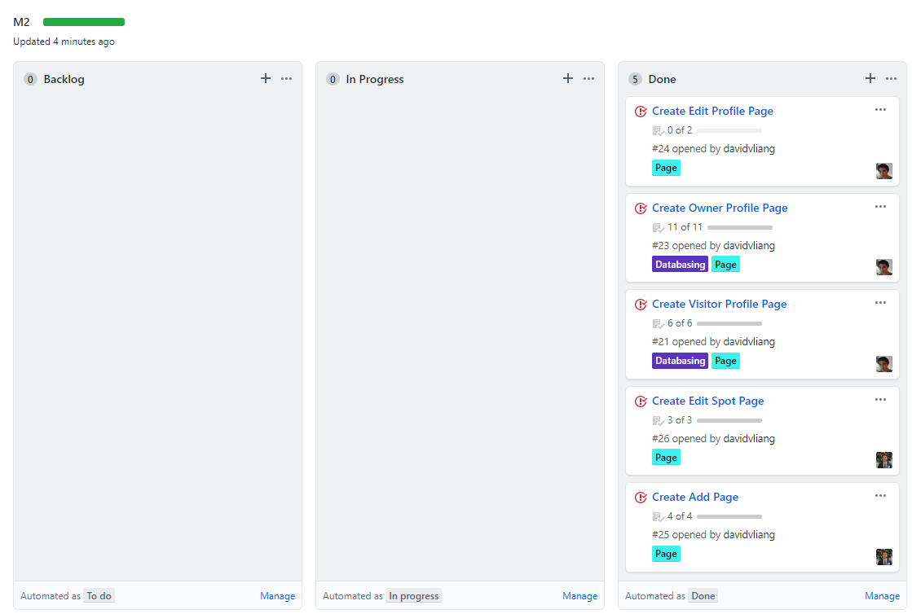
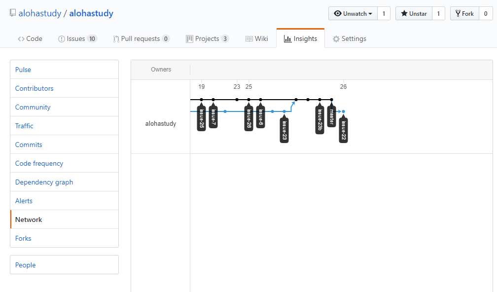

# Table of Contents

* [About AlohaStudy](#about-alohastudy)
* [User Guide](#user-guide)
  * [Installation](#installation)
* [Project Goals](#project-goals)
* [Application Design](#application-design)
  * [Beyond the Basics](#beyond-the-basics)
  * [Description of Application](#description-of-application)
* [Development History](#development-history)
  * [Milestone 1](#milestone-1)
* [Contact Us](#contact-us)

# About AlohaStudy

AlohaStudy is a Meteor application designed to provide students a listing of hidden study spots. In this site, you will be provided a listing with ratings, hours, capacity, accessibility, and capabilities of each study spot. It will also include a feature allowing students to give real-time feedback if it's either used or not used with a timestamp.

This application will give students the access and convenience of knowing where and when to go to hidden study spots.

# User Guide

 - Landing Page -  <a href='http://alohastudy.meteorapp.com/#/'>Link</a>
 
 This is the first page a new user will see. It contains some information about the site as well as how to use it. There is also some information on the site's creators.
 
 - List Spots - <a href='http://alohastudy.meteorapp.com/#/listSpots'>Link</a>
 
 This page displays all verified spots. It is intended to allow general users to browse spots that have been posted. From here they can see if a spot is noisy, has outlets or is indoors. There are also ratings displayed for each spot. Clicking the title of a spot will redirect the user to that spot's info page. A banned user cannot visit this page. A user can edit their own spots from this page. An admin can edit any visible spots from this page.
 
 - Admin List Spots - <a href='http://alohastudy.meteorapp.com/#/adminSpots'>Link</a>
 
 This page builds off the List Spots page but instead shows all spots, including unverified ones. This page is intended to allow admins to view all spots and moderate them. For example it allows admins to navigate to unverified posts and consider verifying them. Admins can edit any spots on this page
 
 - Profile Page - <a href='http://alohastudy.meteorapp.com/#/profile/MyProfile'>Link</a>
 
 This page displays the profile page of the currently logged in user. If a valid id is given in the url field then it will instead display the profile page of the user with that id. The information on this page contains the user's name, status and bio. It also shows a list of all their spots. Admins and users are able to edit these spots with the usual restrictions. Navigating to this page when not logged in will currently error. This is to be fixed.
 
 - Spot Info Page - <a href='http://alohastudy.meteorapp.com/#/view/msAu33FngnCjMNcPv'>Link</a>
 
 This page shows public information on a certain spot. If not verified then there will be a large red tag displaying as such. This spot also shows the name of the spot creator and displays their status and profile picture. This page will eventually have a comment system built into it.
 
 - Add Spot - <a href='http://alohastudy.meteorapp.com/#/add'>Link</a>
 
 This page allows a user to add a spot to the database. It will have it so that in general posts will be initially unverified. A spot submitted by a verified user will be automatically verified.
 
 - Edit Spot - <a href='http://alohastudy.meteorapp.com/#/edit/id'>Link</a>
 
 This page allows a user to edit the spot. The form will initially be filled out with the data that the spot currently has. Clicking submit will update the spot with the new information that has been put in the form.
 
 - Login/Logout/Sign up - <a href='http://alohastudy.meteorapp.com/#/signin'>Link</a>
 
 This page is where users can login.
 
 - view profile - <a href='http://alohastudy.meteorapp.com/#/'>Link</a>
 <br>
 <br>
 
 This allows a user to view their own profile


## Installation
First, [install Meteor](https://www.meteor.com/install).

Second, [download a copy of AlohaStudy](https://github.com/alohastudy/alohastudy/archive/master.zip), or clone it using git.

Third, cd into the app/ directory and install libraries with:

```
$ meteor npm install
```

Fourth, run the system with:

```
$ meteor npm run start
```

If all goes well, the application will appear at [http://localhost:3000](http://localhost:3000). From here you can make an account or login with a pre-existing one. 

# Project Goals
 - People can create accounts as users
 - Users can submit spots but they must be verified by admins
 - Users can comment on posts
 - Accounts can get verified so they can freely post spots
 - Admins can delete comments and posts
 - Filter function available for viewing certain posts
 - Users have profiles that show spots they have made
 
# Application Design

We designed the application using a common web app template. We have a folder for config files and one for app files.

In the app files things are further organized. For example there are folders for things to be loaded by the client, things to be loaded by the server and thing to be loaded by both. The components, pages and layout folders found in the ui helped organize the different React components we would use during the project.

Components involved different pieces of code that may be called frequently by other components or pages. Pages represented the information that separated different pages from each other. This would include almost everything except the navbar and footer. The layout contained only the App.jsx file which put all the pages together and organized the backend of visiting a page.

We used Semantic-UI React and JavaScript as well as html and css to create the app. ESLint was used to help error check the code and keep our code up to standard. These standards helped keep the code readable and efficient.

#### Beyond the Basics

 - Allow users to create/edit/delete spots
 - Allow users to create/edit/delete reviews
 - Search for spots by keyword
 - Filter spots by attributes (noisiness, indoors, air-conditioned)
 - Banned users are restricted from viewing spot/leaving comments/uploading spots
    
# Description of Application
 
   We wish to have a landing page that would have tabs going to a different functions of our website. The Landing page would have tabs for signing up or logining. 
   
   For admins, they would have access to functionalities of the admin list of spots, adding spots, editing/deleting spots, and verifying users on a whitelist. For verified users, they would have access to the list of spots, add spots, edit spots, profile edit, and feedback. For unverified users, they must be approved by an admin. The unverified user would have access to the list of posts and an add spot which would be verified by an admin. 
   
   Both the admin and verified user would have access to a button that would indicate how filled a study spot is from empty, partially filled, and filled. Verified and Admin users can provided reviews and feedback.

# Development History

## Milestone 1

We began by drafting notes on a shared Google Drive. From here we designed our issues that we would use for the project. We then began creating all the logistical items needed to properly coordinate and plan. This included creating an organization, repositories, project board and milestone for milestone 1 and issues.

We then created a basic version of this page you are viewing now as well as a basic version of our actual project. It was reviewed by our professor Philip Johnson. From his feedback we made changes to the page and project.


We then developed about half of the issues we had planned to complete by the end of the semester. This totalled at 11 issues. It was cleaned up to become presentable for milestone 1.


We utilized issue driven development. This includes having each issue completed on its own branch for the most part. This can be seen in the following network graph.


## Milestone 2

Milestone 2 adds the ability for users to interact with the databases. This is specifically with the additional of add/edit spot pages and profile pages. A user can now add a spot and then edit any of their own spots. Admins are given the ability to edit anyone's spot. Profiles were added as a database item separate from the accounts. This is to distance the accessibility of a biography page from sensitive login information. Links to the creator of a spot appear on each spot in the spot list page. A user can view their own profile page by clicking on their username in the top right and clicking "view profile". This will direct them to the url "http://localhost:3000/#/profile/myProfile". This is useful since it allows an easy way for any user to view their own profile without knowing their long generated profile url. An example of a long generated url could be "http://localhost:3000/#/profile/c4Qc3aSSAR4CALC5J".


We then developed about half of the issues we had planned to complete by the end of the semester. This totalled at 5 issues. While working we found that some issues were very closely related. This lead us to combine issues into more sensible formats. It was cleaned up to become presentable for milestone 2.



We utilized continued practicing issue driven development. This can be seen in the following network graph.




# Contact Us

 - Isaac Lee: ilee72@hawaii.edu

 - David Liang: david947@hawaii.edu

 - Andrew Millard: millarda@hawaii.edu


